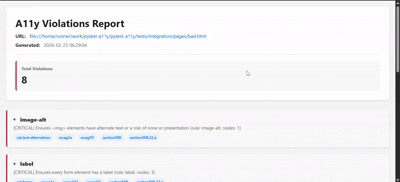
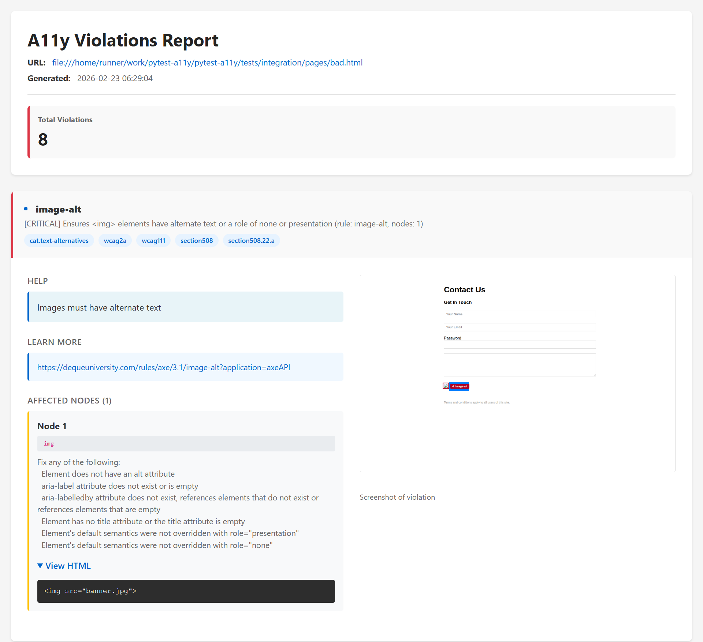
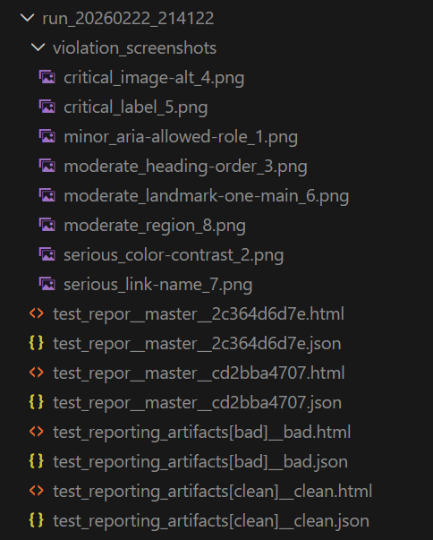

# pytest-a11y

[](https://www.python.org/downloads/)
[](https://pytest.org)
[](https://opensource.org/licenses/MIT)


**Automated accessibility testing for Selenium test suites using pytest and axe-core.**

`pytest-a11y` is a pytest plugin that integrates **axe-core accessibility scanning directly into your UI tests**, allowing teams to detect accessibility violations early and generate **rich, actionable reports with screenshots and WCAG references**.

## Live Demo

View a real accessibility report generated by pytest-a11y:

https://m-farial.github.io/pytest-a11y/sample-report.html

---

## Demo

Run accessibility scans with a single command:

```bash
pytest --a11y
```

pytest-a11y will automatically:

- Run axe-core accessibility scans
- Detect WCAG violations
- Generate HTML and JSON reports
- Capture screenshots of affected elements



---

## Example Accessibility Report

The generated report highlights:

- Violation severity
- WCAG rule references
- Affected HTML nodes
- Screenshots showing exactly where the issue occurs



---

## Why pytest-a11y?

Accessibility testing is often:

- Manual
- Performed late in development
- Difficult to integrate into CI pipelines

pytest-a11y allows teams to **shift accessibility testing left** by running accessibility checks as part of their automated UI tests.

### Key Features

- Automated accessibility scans using **axe-core**
- Interactive HTML reports with violation breakdown
- Screenshots of each violation with visual overlays
- Compatible with **pytest-xdist** for parallel execution
- Works with **any Selenium-based framework**
- Optional execution via `--a11y` flag
- Structured artifact output for CI pipelines

---

## Prerequisites

Before installing pytest-a11y, make sure you have the following:

- **Python 3.10+**
- **pytest 8.0+**
- **A Selenium WebDriver setup** — pytest-a11y works with any Selenium-based framework. You will need a browser driver such as [ChromeDriver](https://chromedriver.chromium.org/) or [GeckoDriver](https://github.com/mozilla/geckodriver) installed and available on your `PATH`.
- A `driver` fixture that provides a `WebDriver` instance to your tests (see step 2 below).

---

## Quick Start

### 1. Install

```bash
pip install pytest-a11y
```

Or with Poetry:

```bash
poetry add pytest-a11y
```

```toml
[tool.poetry.dependencies]
pytest-a11y = "^1.0.0"
```

### 2. Set Up the Driver Fixture

pytest-a11y requires a `driver` fixture that provides a Selenium `WebDriver` instance. Add the following to your `conftest.py`:

```python
import pytest
from selenium import webdriver
from selenium.webdriver.remote.webdriver import WebDriver


@pytest.fixture
def driver() -> WebDriver:
    """Provide a Selenium WebDriver instance for tests."""
    options = webdriver.ChromeOptions()
    options.add_argument("--headless")  # Run without opening a browser window
    driver = webdriver.Chrome(options=options)
    yield driver
    driver.quit()  # Clean up after each test
```

> This example uses Chrome. Swap `webdriver.Chrome` for `webdriver.Firefox` (and `ChromeOptions` for `FirefoxOptions`) if you prefer Firefox.

### 3. Write a Test

```python
from selenium.webdriver.remote.webdriver import WebDriver

from pytest_a11y import assert_no_axe_violations
from pytest_a11y.types import AxeRunnerProtocol


def test_homepage_accessibility(
    driver: WebDriver,
    axe: AxeRunnerProtocol,
) -> None:
    """Test that the homepage has no accessibility violations."""
    driver.get("https://www.saucedemo.com/")

    # Run accessibility checks
    results = axe.run()

    # Assert no violations found
    assert_no_axe_violations(results)
```

### 3.1 Configure Standards and Aliases

`pytest-a11y` accepts both canonical values (e.g. `wcag21aa`) and dot-notation aliases (e.g. `wcag2.1:aa`) for `--a11y-standard`. Invalid values raise `pytest.UsageError` with a clear message listing supported options.

See the full list of supported standards and aliases in [Configuration → Accessibility Standards](#accessibility-standards).

Example:

```bash
pytest tests/test_a11y.py --a11y --a11y-standard wcag2.1:aa -v
```

### 3.2 Configure Custom axe Tags

You can also pass [raw axe tags](https://github.com/dequelabs/axe-core/blob/develop/doc/API.md#axe-core-tags) via `--a11y-tags` instead of a standard mapping:

```bash
pytest tests/test_a11y.py --a11y --a11y-tags best-practice,cat.forms -v
```

### 4. Run Without Reports

```bash
pytest tests/test_a11y.py -v
```

**Output:**
```
tests/test_a11y.py::test_homepage_accessibility PASSED
```

Simple assertion - no reports generated.

### 5. Run With Reports

```bash
pytest tests/test_a11y.py --a11y -v
```

**Output:**
```
tests/test_a11y.py::test_homepage_accessibility PASSED
```

Reports automatically generated in `.a11y_reports/run_YYYYMMDD_HHMMSS/`:
- `test_homepage_accessibility_saucedemo_home_abc123d.html` - Interactive HTML report with screenshots
- `test_homepage_accessibility_saucedemo_home_abc123d.json` - Machine-readable JSON report
- `violation_screenshots/` - Individual screenshots of each violation

Report filenames now include a normalized page slug derived from the current URL (for example, `saucedemo_home`), while the stable hash suffix ensures uniqueness.

---

## Examples

The full set of runnable examples is consolidated in [docs/usage.md](docs/usage.md).

This includes:

- simple accessibility assertions
- critical-only checks
- results inspection
- viewport testing
- dark mode testing
- interaction flows
- parameterized multiple-page tests

Use `pytest --a11y` to generate HTML and JSON reports for each example.

---

## Generated Artifacts

When using `--a11y`, reports are generated to `.a11y_reports/run_YYYYMMDD_HHMMSS/`:

### HTML Report

Interactive report with:
- ✓ Violation list with details
- ✓ Screenshots of affected areas
- ✓ WCAG references
- ✓ Pass/fail/incomplete breakdown
- ✓ Timestamp and URL

Open in browser: `open .a11y_reports/run_*/test_*.html`

### JSON Report

Machine-readable report for CI/CD integration:

```json
{
  "test_name": "test_homepage",
  "timestamp": "2026-02-14T15:30:22",
  "url": "https://example.com",
  "violation_count": 3,
  "violations": [
    {
      "id": "color-contrast",
      "impact": "serious",
      "description": "...",
      "nodes": [...]
    }
  ]
}
```

### Violation Screenshots

Individual screenshots for each violation in `violation_screenshots/`:
- `0_color-contrast.png`
- `1_alt-text.png`
- etc.



---

## Design & Key Concepts

### One Fixture: `axe`

The `axe` fixture provides an accessibility checker bound to your WebDriver. Simply declare it as a parameter in your test function — no extra setup needed:

```python
def test_accessibility(axe):
    results = axe.run()
    # results is AxeResults - dict-like structure from axe-core
```

**That's it.** No special fixture for reports, no fixture selection needed.

### Simple Assertions

Choose the assertion that matches your needs:

```python
# Fail on ANY violation
from pytest_a11y import assert_no_axe_violations

results = axe.run()
assert_no_axe_violations(results)
```

```python
# Fail on CRITICAL violations only (allow minor issues)
from pytest_a11y import assert_no_critical_violations

results = axe.run()
assert_no_critical_violations(results)
```

```python
# Use structured Results for inspection first
from pytest_a11y import Results, assert_results_no_violations

results = axe.run()
processed = Results.from_axe(results)

print(f"Found {processed.violation_count} violations")
for violation in processed.violations:
    print(f"  - {violation.id}: {violation.impact}")

assert_results_no_violations(processed)
```

### Optional Reports

Reports are only generated when you pass the `--a11y` flag. Without it, tests run as normal assertions with no files written. See [Quick Start → Steps 4 & 5](#4-run-without-reports) for usage examples, and [Configuration → Custom Report Directory](#custom-report-directory) for controlling where reports are written.

### Accessibility Standards and Aliases

For the full list of supported WCAG standards, aliases, and custom tag usage, see [Configuration → Accessibility Standards](#accessibility-standards).

---

## API Reference

### Fixtures

#### `axe: AxeRunnerProtocol`

Provides an accessibility checker bound to the WebDriver.

**Methods:**

```python
# Run axe-core checks on current page
results: AxeResults = axe.run()

# Count violations
count: int = axe.violation_count(results)

# Count passed checks
count: int = axe.pass_count(results)

# Count incomplete checks (need manual review)
count: int = axe.incomplete_count(results)

# Check if any violations exist
has_issues: bool = axe.has_violations(results)

# Convert to structured Results
structured: Results = axe.process_results(results)
```

### Assertions

#### `assert_no_axe_violations(results: AxeResults) -> None`

Assert that no violations exist in the results.

- **Reports:** Auto-generated if `--a11y` flag enabled
- **Fails on:** Any violation
- **Use when:** You want strict accessibility compliance

```python
results = axe.run()
assert_no_axe_violations(results)
# Reports auto-generated to .a11y_reports/ if --a11y used
```

#### `assert_no_critical_violations(results: AxeResults) -> None`

Assert that no critical-severity violations exist.

- **Reports:** Auto-generated if `--a11y` flag enabled
- **Fails on:** Only critical violations (allows serious, moderate, minor)
- **Use when:** You're working on compliance gradually

```python
results = axe.run()
assert_no_critical_violations(results)
# Only fails on critical issues; reports still generated
```

#### `assert_results_no_violations(results: Results) -> None`

Assert that a processed Results object has no violations.

- **Reports:** Not auto-generated (use with raw results for reports)
- **Input:** Results object (from `Results.from_axe()`)
- **Use when:** You're inspecting results before asserting

```python
axe_results = axe.run()
results = Results.from_axe(axe_results)

if results.has_violations:
    print(f"Found {results.violation_count} violations")

assert_results_no_violations(results)
```

#### `assert_results_no_critical(results: Results) -> None`

Assert that no critical violations exist in a Results object.

```python
axe_results = axe.run()
results = Results.from_axe(axe_results)
assert_results_no_critical(results)
```

### Types

All types are fully typed for IDE autocompletion and type checking.

#### `AxeResults`

Raw output from axe-core (TypedDict):

```python
from pytest_a11y.types import AxeResults

results: AxeResults = axe.run()

# Available keys
violations: list = results["violations"]
passes: list = results["passes"]
incomplete: list = results["incomplete"]
inapplicable: list = results["inapplicable"]
timestamp: str = results["timestamp"]
url: str = results["url"]
```

#### `Results`

Processed, structured results (dataclass):

```python
from pytest_a11y.types import Results

axe_results: AxeResults = axe.run()
results: Results = Results.from_axe(axe_results)

# Properties
print(results.violation_count)  # int
print(results.pass_count)       # int
print(results.has_violations)   # bool
print(results.url)              # str
print(results.timestamp)        # str

# Lists of violations
for violation in results.violations:
    print(violation.id)          # rule ID like "color-contrast"
    print(violation.description) # human-readable description
    print(violation.impact)      # "critical", "serious", "moderate", "minor"
    
    for node in violation.nodes:
        print(node.selector)     # CSS selector
        print(node.html)         # element HTML
```

#### `AxeRunnerProtocol`

Interface for the axe fixture:

```python
from pytest_a11y.types import AxeRunnerProtocol

def test_example(axe: AxeRunnerProtocol) -> None:
    results = axe.run()
    # Full type hints for IDE autocompletion
```

---

## Configuration

### Custom Report Directory

```bash
pytest tests/ --a11y --a11y-dir ./my_reports -v
```

Or set via environment variable:

```bash
export A11Y_DIR=./my_reports
pytest tests/ --a11y -v
```

Or in `pytest.ini`:

```ini
[pytest]
a11y_reports = ./my_reports
```

Or in `conftest.py`:

```python
def pytest_configure(config):
    config.option.a11y_reports = "./my_reports"
```

**Configuration Priority** (highest to lowest):
1. conftest.py
2. CLI `--a11y-dir`
3. pytest.ini
4. Environment variable `A11Y_DIR`
5. Default `.a11y_reports`

### Parallel Testing with xdist

Works seamlessly with `pytest-xdist`:

```bash
pytest tests/ --a11y -n auto -v
```

Filenames are automatically safeguarded for parallel execution.

### Accessibility Standards

Supports multiple accessibility standards:

- **wcag2a** - WCAG 2.0 Level A (minimum compliance)
- **wcag2aa** - WCAG 2.0 Level AA (standard compliance) - **Default**
- **wcag2aaa** - WCAG 2.0 Level AAA (enhanced compliance)
- **wcag21a** - WCAG 2.1 Level A
- **wcag21aa** - WCAG 2.1 Level AA
- **wcag22aa** - WCAG 2.2 Level AA
- **section508** - Section 508 Amendment (US federal requirement)

Dot-notation aliases are also supported:

| Alias | Resolves to |
|---|---|
| `wcag2.0:a` | `wcag2a` |
| `wcag2.0:aa` | `wcag2a, wcag2aa` |
| `wcag2.0:aaa` | `wcag2a, wcag2aa, wcag2aaa` |
| `wcag2.1:a` | `wcag21a` |
| `wcag2.1:aa` | `wcag21a, wcag21aa` |
| `wcag2.2:aa` | `wcag2aa, wcag21aa, wcag22aa` |

Invalid values raise `pytest.UsageError` with a clear message listing all supported options.

Specify via CLI:

```bash
pytest --a11y --a11y-standard wcag2aa
pytest --a11y --wcag-level AA
pytest --a11y --a11y-tags wcag21a,wcag21aa,ACT,cat.forms
```

Or via `pytest.ini` (sample supported keys shown):

```ini
[pytest]
a11y_reports = ./my_reports
a11y_standard = wcag21aa
a11y_tags = best-practice,cat.forms
```

The `--a11y-tags` option passes raw axe tags directly and does not apply any alias or standard mapping.

---

## CI Integration

pytest-a11y works seamlessly in CI pipelines.

### GitHub Actions

```yaml
name: Accessibility Tests

on: [push, pull_request]

jobs:
  a11y:
    runs-on: ubuntu-latest
    steps:
      - uses: actions/checkout@v3
      - uses: actions/setup-python@v4
        with:
          python-version: "3.10"
      
      - run: pip install -e ".[dev]"
      - run: pytest --a11y
      
      - name: Upload Reports
        if: always()
        uses: actions/upload-artifact@v3
        with:
          name: a11y-reports
          path: .a11y_reports/
```

### GitLab CI

```yaml
accessibility:
  image: python:3.10
  script:
    - pip install -e ".[dev]"
    - pytest --a11y
  artifacts:
    paths:
      - .a11y_reports/
    when: always
```

---

## Works Great With

pytest-a11y integrates perfectly with Selenium automation frameworks such as **sel-py-template** — a scalable Selenium + pytest framework featuring:

- Page Object Model
- CI-ready automation pipelines
- Structured test artifacts
- Reusable fixtures

Repository: https://github.com/m-farial/sel-py-template

Together they provide a **complete UI testing + accessibility testing ecosystem**.

---


## Development

Clone the repository and install dependencies:

```bash
git clone https://github.com/m-farial/pytest-a11y.git
cd pytest-a11y
poetry install
```

Run tests:

```bash
pytest
```

---

## Contributing

Contributions welcome! Please:

1. Fork the repository
2. Create a feature branch
3. Write tests
4. Submit a pull request

---

## Changelog

See [CHANGELOG.md](CHANGELOG.md) for a full history of releases and changes.

---

## License

MIT License

---

## Acknowledgements

- [axe-core](https://github.com/dequelabs/axe-core) - The accessibility checker
- [axe-selenium-python](https://github.com/dequelabs/axe-selenium-python) - Python wrapper
- [pytest](https://pytest.org) - The testing framework
- [Selenium](https://www.selenium.dev) - Web browser automation

For issues and questions, please see [GitHub Issues](https://github.com/m-farial/pytest-a11y/issues).